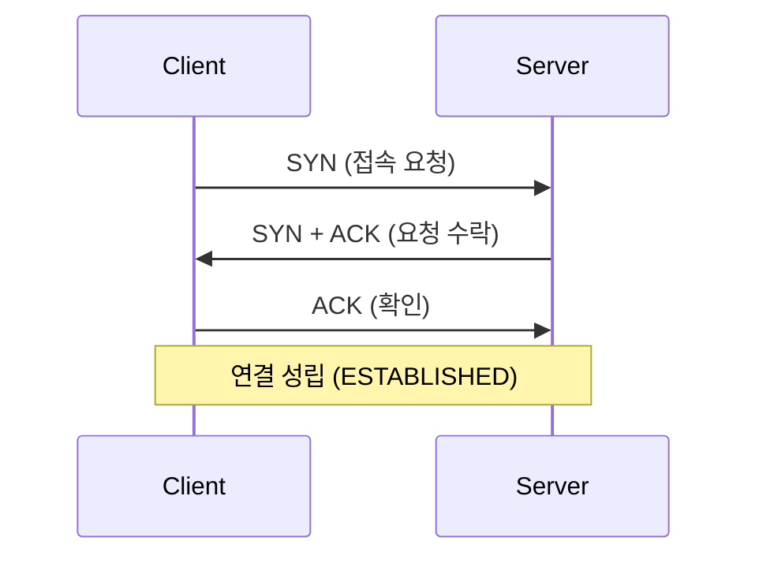

# 제4장. 네트워크 (Network)

> **[심화] (Deep Dive)** 섹션이 추가되었습니다.

## 📌 왜 배워야 하나요? (Why?)
우리가 만든 서비스는 네트워크를 통해 사용자에게 전달됩니다. **느린 응답 속도, 연결 끊김, 보안 이슈(HTTPS)**의 원인을 찾고 해결하려면 데이터가 어떻게 패킷으로 쪼개져서 이동하는지 알아야 합니다. 특히 MSA(Microservices Architecture) 환경에서는 서비스 간 통신 이해가 필수입니다.

---

## 1. 네트워크의 큰 그림

### 🔑 핵심 개념
*   **LAN (Local Area Network)**: 집, 사무실 등 좁은 지역의 네트워크. (예: Wi-Fi, 이더넷)
*   **WAN (Wide Area Network)**: LAN들을 연결한 넓은 지역의 네트워크. (예: 인터넷)
*   **프로토콜 (Protocol)**: 컴퓨터끼리 소통하기 위한 약속/규약입니다.
*   **노드 (Node)**: 네트워크에 연결된 장치(PC, 라우터, 스위치 등).
*   **링크 (Link)**: 노드와 노드를 연결하는 물리적/논리적 회선.

---

## 2. TCP/IP 모델과 OSI 7계층

데이터가 전송될 때 각 계층을 거치며 헤더가 붙거나(캡슐화) 떨어지는(역캡슐화) 과정을 거칩니다.

### 📦 캡슐화 (Encapsulation) 과정
데이터를 보낼 때 상위 계층에서 하위 계층으로 내려가며 헤더를 붙입니다.
1.  **Application**: Data
2.  **Transport**: TCP Header + Data (Segment)
3.  **Network**: IP Header + TCP Header + Data (Packet)
4.  **Data Link**: Frame Header + IP Header ... + Frame Trailer (Frame)
5.  **Physical**: Bit Stream (010101...)

---

## 3. 애플리케이션 계층 (Application Layer)

사용자와 가장 가까운 계층입니다.

### 🌐 HTTP & HTTPS
*   **HTTP (HyperText Transfer Protocol)**: 웹에서 데이터를 주고받는 프로토콜. (Stateless 특징)
*   **HTTPS**: HTTP에 보안(Secure) 계층인 **SSL/TLS**를 추가하여 데이터를 암호화한 것.
*   **DNS (Domain Name System)**: 사람이 읽을 수 있는 도메인 이름(`www.google.com`)을 IP 주소(`142.250.xxx.xxx`)로 변환해주는 시스템.
*   **DHCP**: IP 주소를 자동으로 할당해주는 프로토콜.

---

## 4. 전송 계층 (Transport Layer)

데이터의 신뢰성 있는 전송을 담당합니다. (End-to-End 통신)

### 🆚 TCP vs UDP
*   **TCP (Transmission Control Protocol)**:
    *   **연결 지향형 (Connection-oriented)**: 3-way handshake로 연결 수립.
    *   **신뢰성 보장**: 데이터 순서 보장, 손실 시 재전송. (가상 회선 방식)
    *   **흐름 제어 / 혼잡 제어** 기능 포함.
*   **UDP (User Datagram Protocol)**:
    *   **비연결형 (Connection-less)**: 연결 과정 없이 바로 데이터 쏘아 보냄.
    *   **신뢰성 낮음**: 근데 빠름. (실시간 스트리밍, 게임 등에 사용)

### 🤝 TCP 3-way Handshake (연결 수립)

1.  **SYN**: 클라이언트가 서버에 연결 요청(난수 A 전송).
2.  **SYN+ACK**: 서버가 요청 수락(난수 B)하고 ACK(A+1) 전송.
3.  **ACK**: 클라이언트가 서버의 수락 확인(B+1) 전송.

※ 연결 종료는 **4-way Handshake**를 사용합니다.

---

## 5. 네트워크 계층 (Network Layer)

데이터를 목적지까지 가장 안전하고 빠르게 보냅니다. (경로 설정)

### 📍 IP (Internet Protocol)
*   **IP 주소**: 네트워크 상의 주소. (IPv4: 32비트, IPv6: 128비트)
*   **서브넷 마스크 (Subnet Mask)**: IP 주소에서 네트워크 부분과 호스트 부분을 나누는 기준.
*   **라우팅 (Routing)**: 목적지까지 갈 수 있는 여러 경로 중 최적의 경로를 설정하는 것.
*   **NAT (Network Address Translation)**: 사설 IP를 공인 IP로 변환하는 기술. (공유기 원리)

---

## 6. 데이터 링크 & 물리 계층

*   **MAC 주소**: 네트워크 인터페이스 카드(NIC) 고유의 물리적 주소. (변경 불가 원칙)
*   **스위치 (Switch)**:
    *   **L2 스위치**: MAC 주소 기반으로 패킷 전달.
    *   **L3 스위치**: IP 주소 기반으로 라우팅 기능 추가.
    *   **L4 스위치**: 포트 번호 기반으로 **로드 밸런싱(Load Balancing)** 수행. (중요!)
    *   **L7 스위치**: 애플리케이션 데이터(URL, 쿠키 등)를 분석하여 로드 밸런싱.

---

## 🎓 Data Engineer & ML Interview Q&A

**Q1. 주소창에 `www.naver.com`을 쳤을 때 일어나는 과정을 설명해 보세요.**
> **A.** (매우 전형적이고 중요한 질문입니다)
> 1. 브라우저가 **DNS 서버**에 요청하여 도메인의 IP 주소를 획득합니다.
> 2. IP 주소와 ARP를 통해 MAC 주소를 알아내고, 대상 서버와 **TCP 3-way Handshake**를 통해 연결을 수립합니다.
> 3. 연결이 되면 **HTTP Request** 메시지를 보냅니다.
> 4. 서버(WAS/DB)에서 요청을 처리하고 **HTTP Response** (HTML 등)를 보냅니다.
> 5. 브라우저가 응답 받은 데이터를 렌더링하여 화면에 보여줍니다.

**Q2. TCP와 UDP의 가장 큰 차이점과 본인이 설계한다면 어떤 상황에 무엇을 쓸 것인가요?**
> **A.** 가장 큰 차이는 **신뢰성**과 **속도**입니다. 결제 시스템이나 파일 전송처럼 데이터가 단 1비트라도 깨지면 안 되는 곳에는 **TCP**를 사용하고, 라이브 동영상 스트리밍이나 FPS 게임 위치 정보처럼 약간의 손실이 있어도 빠른 반응 속도가 중요한 곳에는 **UDP**를 사용하겠습니다.

**Q3. 로드 밸런싱(Load Balancing)이란 무엇이고 왜 필요한가요?**
> **A.** 하나의 서버에 트래픽이 몰리는 것을 방지하기 위해 여러 대의 서버에 트래픽을 분산시켜주는 기술입니다. L4 스위치나 AWS ELB 등을 사용하며, 시스템의 **가용성(Availability)**과 **확장성(Scalability)**을 높이기 위해 필수적입니다.

---

## 🔬 Deep Dive: 거대한 인터넷의 작동 원리

### 1. TCP 혼잡 제어 (Congestion Control)
흐름 제어(Flow Control)가 '수신자'를 배려한다면, 혼잡 제어는 '네트워크'를 배려합니다.
*   **Slow Start**: 처음엔 패킷을 1개, 2개, 4개... 지수적으로 늘려가며 네트워크 상황을 간봅니다.
*   **Congestion Avoidance**: 혼잡 윈도우(CWND)가 임계치에 도달하면 선형적으로 1씩 증가시킵니다.
*   **Fast Retransmit**: 패킷 손실이 감지되면(3 Duplicate ACK), 타임아웃을 기다리지 않고 즉시 재전송합니다.
*   **알고리즘**: Tahoe, Reno (가장 유명), Cubic (Linux 기본) 등으로 발전해왔습니다.

### 2. HTTP의 진화 (Evolution)
*   **HTTP/1.1**: Keep-Alive로 연결 재사용. 하지만 **HOL(Head-of-Line) Blocking** 문제 존재 (앞 요청 처리가 늦어지면 뒤도 다 밀림).
*   **HTTP/2**: **Multiplexing** 도입. 하나의 연결로 여러 요청을 동시에 스트림 단위로 주고받아 HOL Blocking 해결. 헤더 압축(HPACK) 지원.
*   **HTTP/3**: TCP 버리고 **UDP 기반의 QUIC** 프로토콜 사용. TCP의 태생적 느림(Handshake, 재전송 지연)을 극복.

### 3. 로드 밸런싱 알고리즘 (L4/L7)
*   **Round Robin**: 순서대로 하나씩. (서버 스펙이 동일할 때 적절)
*   **Least Connection**: 연결 개수가 가장 적은 서버로. (트래픽이 불균형할 때 적절)
*   **IP Hash**: 클라이언트 IP를 해싱하여 특정 서버로 고정. (세션 유지 필요 시 사용 - Sticky Session)

### 4. 보안의 핵심: TLS/SSL Handshake
HTTPS 연결은 어떻게 암호화 키를 교환할까요? (RSA/Diffie-Hellman)
1.  **Client Hello**: "나 이 암호화 방식 지원해. 랜덤값 A 줄게."
2.  **Server Hello**: "그래, 이걸로 하자. 내 인증서랑 랜덤값 B 줄게."
3.  **Key Exchange**: 클라이언트는 서버 인증서를 검증하고, **Pre-Master Secret**을 서버 공개키로 암호화해서 보냅니다.
4.  **Session Key 생성**: 양쪽 모두 A, B, Pre-Master Secret을 조합하여 대칭키(세션키)를 생성하고 통신을 시작합니다.